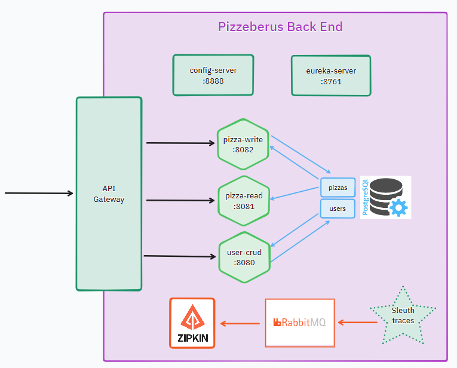

# Pizzeberus
Spring Cloud project for Microservices Hiberus University

# Usage guide
1. ```git clone https://github.com/Leticia-23/Pizzeberus-SpringCloud.git```
2. ``mvn clean install`` to install the project dependencies
3. ``docker-compose up --build`` to get Rabbitmq, Zipkin and PostreSQL up
4. Execute Config Server service
5. Execute Eureka Server service
6. Execute Gateway Server service
7. Execute Users, PizzaRead and PizzaWrite services


# Documentation
- Config server: http://localhost:8888/<service_name>/default
- Eureka server: http://localhost:8761/
- Gateway: http://localhost:9000/
- Users: http://localhost:8080/swagger-ui.html
- PizzaRead: http://localhost:8081/swagger-ui.html
- PizzaWrite: http://localhost:8082/swagger-ui.html

# Software Arquitecture


# Autora
Leticia Sánchez Romero